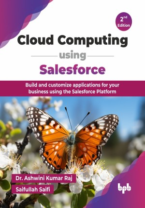

# Cloud Computing using Salesforce - 2nd Edition

Build and customize applications for your business using the Salesforce Platform.

This is the repository for [Cloud Computing using Salesforce - 2nd Edition
](https://bpbonline.com/products/cloud-computing-using-salesforce-2nd-edition?variant=44713138061512),published by BPB Publications.

## About the Book
Salesforce, as the leading cloud-based CRM platform, empowers businesses to manage customer relationships and build custom applications. This book serves as your comprehensive guide to mastering this technology, from foundational cloud concepts to advanced development and administration, enabling you to leverage its full potential.

This book provides a structured journey, starting with cloud computing fundamentals and a thorough introduction to Salesforce, including its Lightning Platform architecture and benefits. This new edition brings in-depth coverage of Lightning Web Components (LWC), equipping you with the skills to build modern, high-performance user interfaces, aligning with the latest Salesforce development standards. Lastly, you will learn how to deploy and debug the app, with enhanced coverage on advanced Apex handlers for robust integrations and asynchronous processing. The book focuses on how to design an app. You will then learn how to use the Salesforce data process and security architecture in the app design and understand how to use force.com to customize the UI and automate the process. Lastly, you will learn practical debugging and deployment techniques.

Upon completing this book, you will be highly competent in declarative and programmatic aspects of Salesforce, ready to confidently build, customize, and manage solutions, and prepared for official Salesforce Administrator, Platform App Builder, and Platform Developer I certifications.

## What You Will Learn
• Get an overview of Salesforce.

• In this edition, learn more about the Lightning Experience unit.

• Understand the design and data process.

• Learn how to develop reports and dashboards in Salesforce.

• Automate business process using Salesforce tools. 

• ⁠Get familiar with the programming in Apex language.

• ⁠Learn and design a custom app and UI using Lightning Web Components.

• ⁠Learn how to debug, deploy and publish the code.
